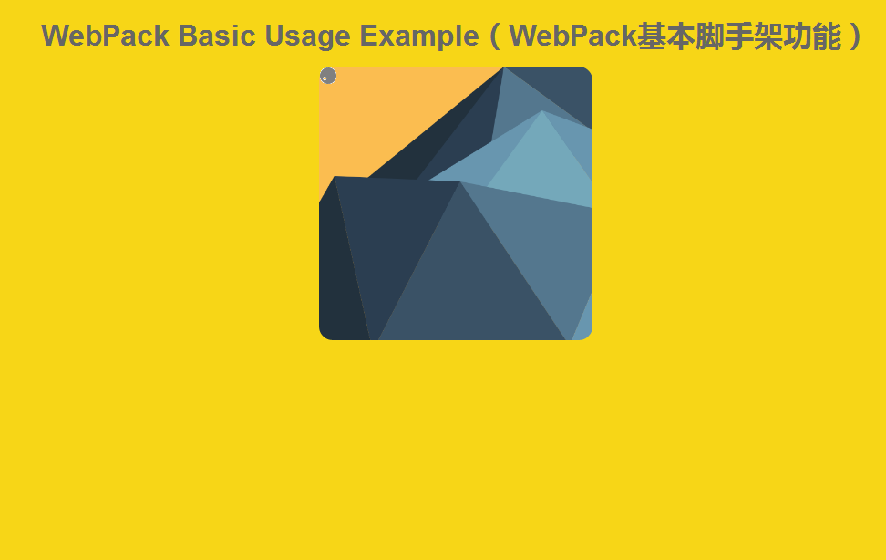

# Amiku WebPack 脚手架

```
本例子展示了WebPack的基本脚手架功能。

==================
分开发调试和打包发布版本：
开发调试：$ npm run dev
打包发布：$ npm run release
==================

功能点：
支持单页面；
使用Babel支持ES6语言；
使用SASS作为CSS样式的语言；
打包图片（大于10k的文件直接复制过去，小于10k的文件作为data-url的base64方式插入到页面中）；
CSS文件直接包含在JavaScript文件里面；

```

### 下载

下载或者克隆本git资源 https://github.com/amiku/Amiku-WebPack.git

> $ git clone https://github.com/amiku/Amiku-WebPack.git
>

### 安装

参照如下的命令npm安装包依赖

```
$ npm install
```

### 开发环境

参照如下的命令运行，之后打开浏览器 http://localhost:8080/ 访问

```
$ npm run dev
```

### 文件打包

参照如下的命令打包文件，之后可以在dist目录下找到打包好的文件

```
$ npm run release
```

### 截图



### 目录结构
│  .babelrc
│  .eslintrc
│  package-lock.json
│  package.json
│  README.md
│  snapshot.png
│  webpack.config.development.js
│  webpack.config.production.js
│  中文文档.md
│  
├─dist
│  │  index.html
│  │  
│  ├─img
│  │      
│  └─js
│          
├─node_modules
│                  
└─src
    │  favicon.ico
    │  
    └─cn.amiku
        │  index.tmpl.html
        │  
        ├─img
        │      img-css-bg.png
        │      img-js-import.gif
        │      
        ├─js
        │      Index.js
        │      IndexComponent.js
        │      
        └─scss
                baseConfig.scss
                Index.scss
                IndexComponent.scss
                
